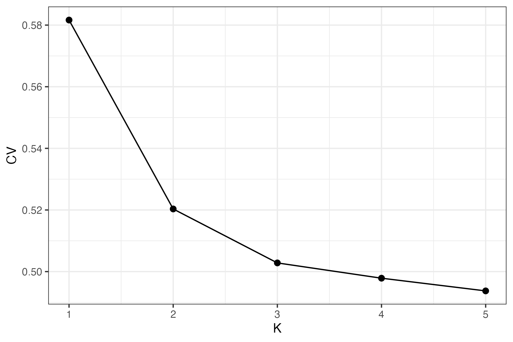
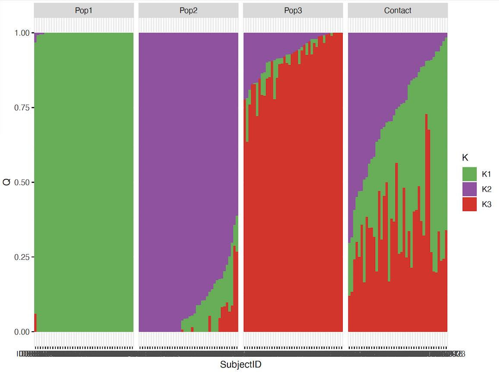

# 01) Initial admixture of empirical pig data

Here we run [ADMIXTURE](https://dalexander.github.io/admixture/download.html) for 1 to 5 clusters.
```sh
cd ./out
for K in {1..5}; do ../software/admixture --cv ../data/gscramble-pigs-keep.bed $K -j8 | tee log${K}.out; done
```

The cross-validation error values are compiled and saved to a file called `cv.sum.txt`.

```sh
cd ./out
grep -h CV log*.out | cut -f2 -d: | sed 's/ //g' > cv.tmp
grep -h CV log*.out | cut -f1 -d")" | cut -f2 -d"=" > k.tmp
paste k.tmp cv.tmp > cv.sum.txt
head cv.sum.txt
```

This is then plotted in R

```r
library(tidyverse)
library(RColorBrewer)
cv.df <- read_table("./out/cv.sum.txt",
                    col_names = c("K", "CV"),
                    show_col_types = F)
p.cv <- ggplot(cv.df) +
  geom_point(aes(x = K, y = CV),
             size = 2) +
  geom_line(aes(x = K, y = CV)) +
  theme_bw()
p.cv
```




### Plotting empirical admixture

Below, we plot the bar plots for the admixture

```r
fesw.admix.meta <- read_table("./data/gscramble-pigs-keep.fam",
                             col_names = c("SampleLocation", "SubjectID", "a", "b", "c", "d")) %>%
                    select(SubjectID, SampleLocation)


cluster_colors <- brewer.pal(n = 4, name = "Set1")

fesw.k3 <- read_table("./out/gscramble-pigs-keep.3.Q",
                      col_names = c("K1", "K2", "K3"),
                      show_col_types = F)

q3.df <- fesw.admix.meta %>%
  cbind(fesw.k3) %>%
  pivot_longer(cols = c(K1,K2, K3), names_to = "K", values_to = "prob")

p.q3 <- q3.df %>%
  ggplot(aes(SubjectID, prob, fill = K)) +
  geom_col() +
    scale_fill_manual(values = cluster_colors[c(3,4,1)],
                      breaks = c("K2", "K1", "K3"),
                      labels = c("K1", "K2", "K3")) +
  facet_grid(~SampleLocation, scales = 'free', space = 'free')
p.q3
```


