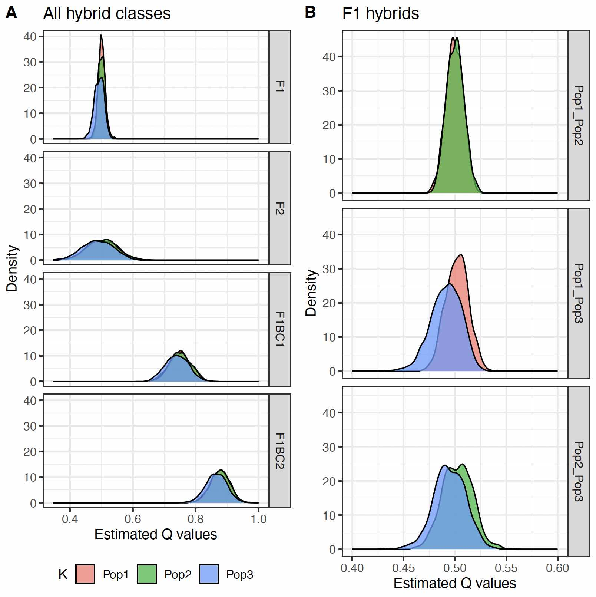

# 03) Results!

This file shows how to produce the figures in the manuscript


Here, read in the `full-summary-LONG.txt` file provided in the previous section

```{r}
library(tidyverse)
library(RColorBrewer)

sim.sum.names <- c("Individual", "GSP", "GSP_iter", "GSP_id", "Ind_iter", 
                   "PopA", "PopB", "Pop1", "Pop2", "Pop3")
sim.sum <- readr::read_table("full-summary-LONG.txt",
                      col_names = sim.sum.names,
                      show_col_types = F) %>%
  mutate(PopA = gsub(pattern = "Pop14",
                     replacement = "Pop3",
                     x = PopA),
         PopB = gsub(pattern = "Pop14",
                     replacement = "Pop3",
                     x = PopB))

cluster_colors <- brewer.pal(n = 4, name = "Set1")
```

### Create the density plot across all hybrid classes

```{r}
all.hybrid.class.df <- sim.sum %>%
  # rename("K1" = "Pop1",
  #        "K2" = "Pop2",
  #        "K3" = "Pop14") %>%
  pivot_longer(cols = c(Pop1, Pop2, Pop3), names_to = "K", values_to = "prob") %>%
  filter(!GSP %in% c("Core")) %>%
  mutate(Pop_combo = factor(paste0(PopA, "_", PopB)),
         GSP = factor(GSP, levels = c("Core", "F1", "F2", "F1BC1", "F1BC2"))) 

p.all.hybrid.class <- all.hybrid.class.df %>%
  filter(K == PopA) %>%
  ggplot() +
  geom_density(aes(prob, fill = PopA),
               alpha = 0.75) +
  theme_bw() +
    facet_grid(rows = vars(GSP)) +
  labs(fill = "K") +
  ylab("Density") +
  xlab("Estimated Q values") +
  theme(legend.position = "bottom") +
  ggtitle("All hybrid classes")


p.all.hybrid.class
```

### Create the density plot of F1 hybrids, showing each population combo

```{r}
p.f1 <- sim.sum %>%
  # rename("K1" = "Pop1",
  #        "K2" = "Pop2",
  #        "K3" = "Pop14") %>%
  pivot_longer(cols = c(Pop1, Pop2, Pop3), names_to = "K", values_to = "prob") %>%
  filter(GSP %in% c("F1"),
         K == PopA | K == PopB) %>%
  mutate(Pop_combo = factor(paste0(PopA, "_", PopB))) %>%
  mutate(Pop_combo = gsub(pattern = "Pop2_Pop1",
                          replacement = "Pop1_Pop2",
                          x = Pop_combo),
         Pop_combo = gsub(pattern = "Pop3_Pop1",
                          replacement = "Pop1_Pop3",
                          x = Pop_combo),
         Pop_combo = gsub(pattern = "Pop3_Pop2",
                          replacement = "Pop2_Pop3",
                          x = Pop_combo)) %>%
  ggplot() +
  geom_density(aes(prob, fill = K),
               alpha = 0.75) +
  xlim(c(0.4, 0.6)) +
  theme_bw() +
    facet_grid(rows = vars(Pop_combo)) +
  ylab("Density") +
  xlab("Estimated Q values") +
  theme(legend.position = "none") +
  ggtitle("F1 hybrids")

p.f1
```

Combine em!

```{r}
p.multi.sim <- ggarrange(p.all.hybrid.class,
                         p.f1,
                         labels = c("A", "B"),
                         ncol = 2)
p.multi.sim
```




